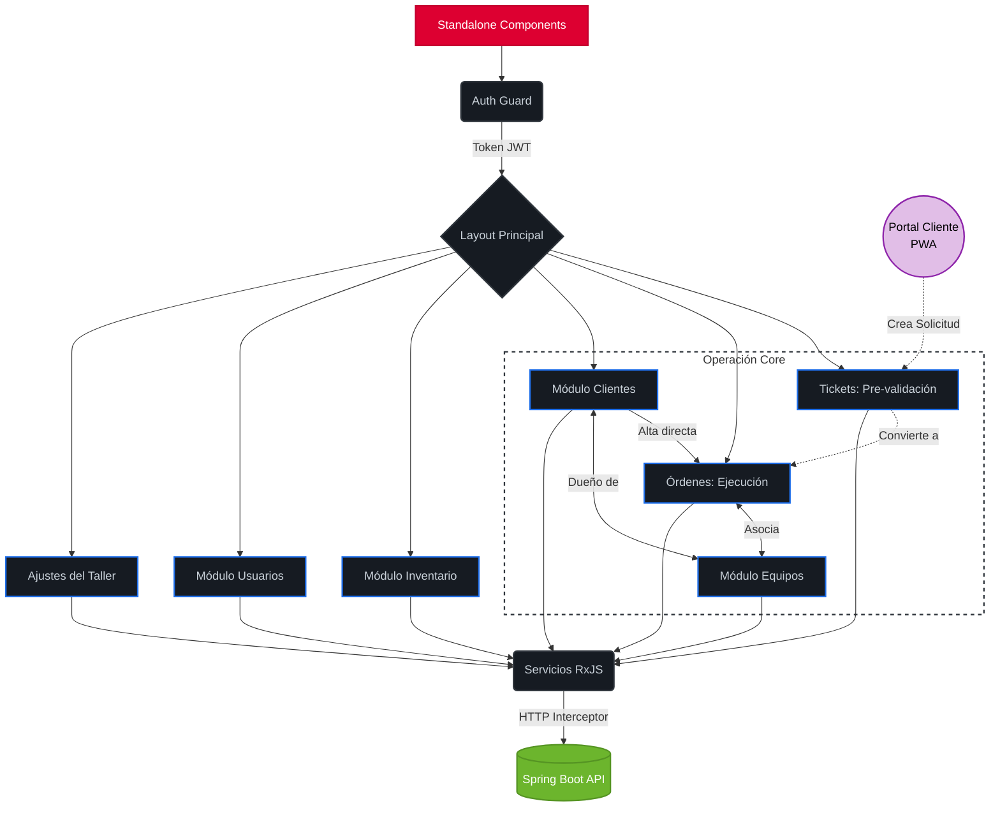
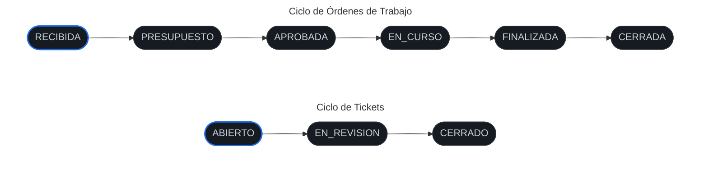

# 🖥️ ReparaSuite - Backoffice Administrativo

Este repositorio contiene el Frontend Administrativo de **ReparaSuite**, una Single Page Application (SPA) de alto rendimiento diseñada para la gestión operativa de talleres de reparación. Construida con **Angular 19** y **Angular Material** (estilizado con SCSS), ofrece una experiencia de usuario fluida, reactiva y orientada a la productividad.
 

## 📖 Vista General del Dashboard

*(Imagen general del Dashboard)*

 

## 🏗️ Flujo de Negocio y Componentes

El panel administrativo actúa como el centro de control del ecosistema. El diseño del negocio es "Client-Centric" (centrado en el cliente), permitiendo una trazabilidad total entre el cliente, sus equipos y su historial de órdenes de trabajo.

🚦 Máquina de Estados (Ciclo de Vida)
La lógica de la interfaz está gobernada por transiciones estrictas de estado, representadas visualmente a continuación para proteger la integridad transaccional del sistema:

Fragmento de código

🚀 Características Principales (Features)
Trazabilidad 360° del Cliente: Vinculación relacional que permite visualizar en tiempo real todos los equipos pertenecientes a un cliente y su historial completo de servicios.

Creación Dual de OTs: Flexibilidad operativa con soporte para alta manual directa (clientes en mostrador) o conversión automatizada desde un Ticket (clientes del portal).

Detalle de OT Unificado: Interfaz que agrupa presupuesto, citas, control de pagos, chat en tiempo real, archivos adjuntos y timeline del historial.

Dashboard Operativo: Panel con indicadores clave, gráficas de distribución mensual y accesos rápidos a la operación diaria.

Modo Claro / Oscuro (Dark Mode): Soporte nativo para cambio de tema dinámico manipulando tokens de Material Design (MDC), garantizando accesibilidad y confort visual.

Estilos Arquitecturados (SCSS): Uso de preprocesadores SCSS para un código de estilos modular, mantenible y sin repeticiones.

🛠️ Stack Tecnológico
Framework: Angular 19 (Standalone Components).

Lenguaje: TypeScript.

Motor de Estilos: SCSS (Sass) avanzado con variables y Nesting.

Librería de UI: Angular Material + Material Design Components (MDC).

Gestión de Asincronía: RxJS Observables.

⚙️ Configuración del Entorno
Requisitos previos
Node.js (v18 o superior)

Angular CLI 19

Instalación rápida
Clonar: git clone https://github.com/GledysP/reparasuite-backoffice.git

Instalar dependencias: npm install

Configurar Entorno: Ajustar la URL de la API en src/environments/environment.ts.

Ejecutar: ng serve
